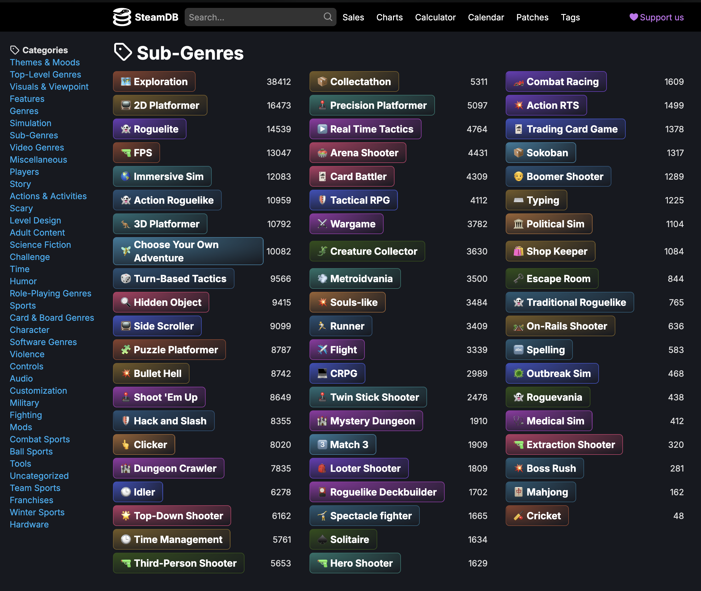
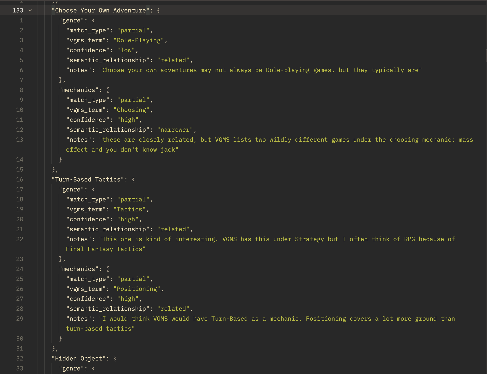
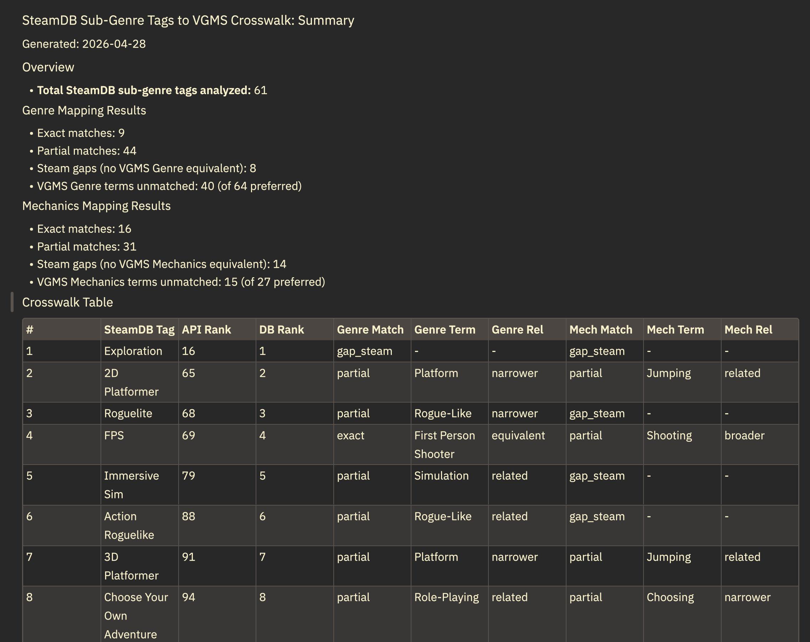

# Steam Tags / VGMS Crosswalk

The artifact which accompanies [this paper](paper/Steam_tags.pdf) is a metadata crosswalk between the current [VGMS](https://gamer.ischool.uw.edu/releases/) (Gameplay Genre v1.3 and Mechanics v1.1) and the 61 Steam tags that SteamDB, a third-party site that displays and extends Steam's tag categories, lists under "Sub-Genres." The crosswalk serves as an intervention in the datafication process the paper describes by forming a structured, repeatable, machine-readable artifact that makes gaps visible and actionable.

The paper describes its scope, the methodological choices behind it, and what it reveals about the gap between community language and the controlled vocabulary.

## At a glance

| | Exact | Partial | Steam gaps |
|---|---|---|---|
| Gameplay Genre | 9 | 44 | 8 |
| Mechanics | 16 | 31 | 14 |

61 SteamDB sub-genre tags analyzed. Full breakdown in [`output/crosswalk_summary.md`](output/crosswalk_summary.md).

## Quickstart

```bash
# Install dependencies
uv sync

# Run the pipeline (each script is independent, but data flows downstream)
uv run scripts/convert_vgms_to_json.py    # VGMS PDFs -> JSON
uv run scripts/collect_steam_tags.py      # Fetch + filter Steam tags
uv run scripts/build_crosswalk.py         # Build crosswalk + summary
```

Output:
- [`data/crosswalk/crosswalk.json`](data/crosswalk/crosswalk.json) — structured crosswalk data
- [`output/crosswalk_summary.md`](output/crosswalk_summary.md) — human-readable summary

## Architecture

The pipeline runs in three stages, each producing JSON consumed by the next. `convert_vgms_to_json.py` converts the VGMS source vocabularies into JSON. `collect_steam_tags.py` fetches Steam's popular tags and filters them to the 61 in SteamDB's Sub-Genre category. `build_crosswalk.py` then reads both vocabularies together with `data/crosswalk/manual_classifications.json` and writes the structured crosswalk and the markdown summary.

The crosswalk sits between SteamDB and VGMS as a supplement that maps the 61 Steam tags SteamDB groups under "Sub-Genres" against two of the VGMS's many controlled vocabularies (Gameplay Genre and Mechanics). Windleharth et al.'s 2016 comparison was conducted from inside the GAMER Group; what this project contributes is an external, reproducible artifact for periodic revision work that doesn't require permission from the schema's maintainers. See the Chains of Datafication section of [the paper](paper/Steam_tags.pdf) for the full discussion.


_Figure 1. Datafication chain from Steam tags to GLAM cataloging. The dashed lines show interpretation without ownership. SteamDB displays and extends Steam's pre-existing classifications. The crosswalk supplements VGMS without being a part of GAMER Group._

## Sample output

Take **Metroidvania**, the case the paper opens with. Here is what the crosswalk produces.

**Input**: SteamDB Sub-Genre tag "Metroidvania," Steam API popularity rank 205, SteamDB Sub-Genre rank 30.

**Manual classification** ([`data/crosswalk/manual_classifications.json`](data/crosswalk/manual_classifications.json)):

```json
"Metroidvania": {
  "genre": {
    "match_type": "partial",
    "vgms_term": "Platform",
    "confidence": "high",
    "semantic_relationship": "related",
    "notes": "This genre, a concatenation of Castlevania + Metroidvania is a colloquially defined genre that encompasses elements of platformer, action, and role-playing elements for character progression."
  },
  "mechanics": {
    "match_type": "partial",
    "vgms_term": "Collecting",
    "confidence": "medium",
    "semantic_relationship": "related",
    "notes": "Metroidvania's typically require you to collect items to unlock the next zone."
  }
}
```

**Fields:**

- **`match_type`** — how the Steam tag relates to the VGMS term. One of:
  - `exact` — the Steam tag and VGMS term refer to the same concept.
  - `partial` — the two overlap but aren't identical; the precise relationship is captured in `semantic_relationship`.
  - `gap_steam` — the Steam tag has no corresponding VGMS term.
- **`confidence`** — `high`, `medium`, or `low`. Reflects how clearly the tag and VGMS term map to one another given the scope notes and use cases at hand.
- **`semantic_relationship`** — the relationship between the tag and the VGMS term, following thesaurus conventions. One of:
  - `equivalent` — the two refer to the same concept.
  - `broader` — the Steam tag is broader than the VGMS term (the tag covers more ground).
  - `narrower` — the Steam tag is narrower than the VGMS term (the tag is a more specific case).
  - `related` — connected but neither is strictly a super- or subset of the other.
  - `no_match` — no meaningful relationship.
- **`notes`** — free-text rationale documenting why the mapping was chosen, edge cases, or hesitations worth surfacing for future reviewers.
- **`vgms_term`** — the VGMS preferred term (from Gameplay Genre or Mechanics) the Steam tag maps to. Empty for `gap_steam` rows.

**Crosswalk output** ([`data/crosswalk/crosswalk.json`](data/crosswalk/crosswalk.json)):

```json
{
  "steam_tag": "Metroidvania",
  "steam_tagid": 1628,
  "steam_api_popularity_rank": 205,
  "steamdb_subgenre_rank": 30,
  "genre_mapping": {
    "match_type": "partial",
    "confidence": "high",
    "semantic_relationship": "related",
    "notes": "This genre, a concatenation of Castlevania + Metroidvania is a colloquially defined genre that encompasses elements of platformer, action, and role-playing elements for character progression.",
    "vgms_term": "Platform",
    "vgms_broader_term": "Action"
  },
  "mechanics_mapping": {
    "match_type": "partial",
    "confidence": "medium",
    "semantic_relationship": "related",
    "notes": "Metroidvania's typically require you to collect items to unlock the next zone.",
    "vgms_term": "Collecting"
  }
}
```

`crosswalk.json` also contains a top-level `vgms_unmatched` block. Those entries reflect the scope of the 61-tag SteamDB Sub-Genres subset, not a finding about VGMS coverage.

Without consistent upkeep of the schema, a player searching for "Metroidvania" in a VGMS-based catalog will receive nothing in return. With the crosswalk, the player at least receives a partial match to Platform.

## Walkthrough

**1. Source folksonomy.** The 61 tags this project maps come from SteamDB's Sub-Genres classifications, an editorial extension of Steam's own Tag Wizard categories.



**2. Analytical work.** Each tag is hand-classified against both VGMS vocabularies in `data/crosswalk/manual_classifications.json` with `match_type`, `vgms_term`, `confidence`, `semantic_relationship`, and `notes`.



**3. Artifact.** Running `scripts/build_crosswalk.py` produces both the structured `crosswalk.json` and a human-readable `crosswalk_summary.md` with headline numbers and the per-tag table.



## Future work

- **General-purpose library**. The matching logic in [`crosswalk/`](crosswalk/) is structured to be vocabulary-agnostic, but it currently has only the Steam/VGMS pipeline as a validating use case. Extracting it as a documented general-purpose library, with scaffolding for new crosswalk projects and a second folksonomy/controlled-vocabulary pair to confirm the claim, is left for future work.
- **Periodic re-runs**. Any specific mapping in this crosswalk will go stale, that is the nature of mapping folksonomies to a standardized schema. Steam users add tags faster than the VGMS can keep up. The current snapshot provides actionable data today, the process provides a tool for revision in the future.

## Acknowledgments

VGMS controlled vocabularies are released by the University of Washington Information School GAMER Group. Source PDFs are not redistributed in this repository; download them from the [GAMER Group GitHub](https://github.com/uwgamergroup). SteamDB Sub-Genre groupings transcribed from [SteamDB's tag browser](https://steamdb.info/tags/).

**AI assistance:** Claude Code (Anthropic) was used as a coding assistant during pipeline development. All manual classifications in `manual_classifications.json`, the analysis in the accompanying paper, and the editorial decisions throughout the crosswalk are the author's own.

## License

Released under the MIT License. See [LICENSE](LICENSE).

---

_The crosswalk reveals the desire lines Steam users have been etching for years. Metroidvania was flagged a decade ago yet remains unpaved. The crosswalk illuminates the path, VGMS has the tools to pave it._
